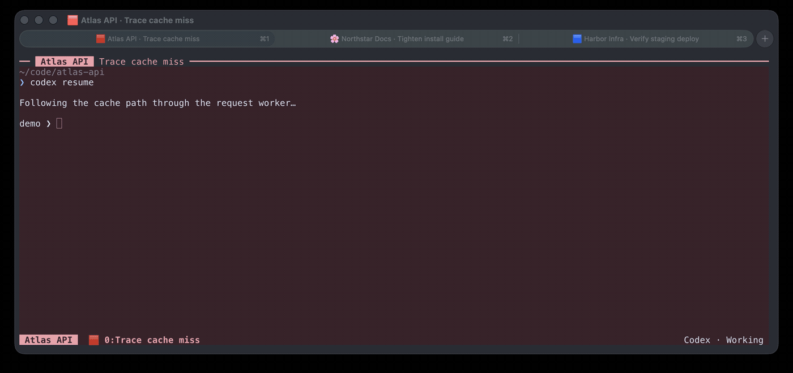

# Ghostty Context Tabs

I spend most of my time with several long-running CLI sessions open at once. The
CLI lets me follow work across repositories and machines without carrying the
weight of another desktop workspace, but after a while every terminal tab starts
to look the same.

Context Tabs is the small fix I use. A new Ghostty tab gets a stable color of its
own. If I am using tmux, the repository, task and state remain visible in a narrow
top band and the footer. It uses terminal and tmux features that already exist;
there is no daemon, account, telemetry or network service.

This is an unofficial companion for [Ghostty](https://ghostty.org/), not a
Ghostty plugin or an upstream project.

[Read the short guide](https://lab.avisekdas.com/).



The recording is a real Ghostty window with three native tabs and tmux context
bands. The repositories, tasks and terminal output are fictional.

## Try it

You need Ghostty and Python 3.8 or newer. tmux is optional. Clone the repository
somewhere you keep user tools:

```sh
git clone https://github.com/vipr8/ghostty-context-tabs \
  ~/.local/share/ghostty-context-tabs
```

Add the command and shell hook to `~/.zshrc` or `~/.bashrc`:

```sh
export PATH="$HOME/.local/share/ghostty-context-tabs/bin:$PATH"
source "$HOME/.local/share/ghostty-context-tabs/shell/context-tabs.sh"
```

The hook runs only in an interactive Ghostty shell. It allocates one color when
the tab is created, stores a small local record with `0600` permissions, and
reapplies that color at the prompt. Nested shells inherit the same tab identity.

The optional Ghostty fragment keeps a 4.5:1 contrast floor. Copy it beside your
Ghostty configuration and include it from `~/.config/ghostty/config.ghostty`:

```sh
cp ~/.local/share/ghostty-context-tabs/ghostty/context-tabs.ghostty \
  ~/.config/ghostty/context-tabs.ghostty
```

```ini
config-file = ?context-tabs.ghostty
```

If you want the context bands, source the tmux fragment from `~/.tmux.conf`:

```tmux
source-file ~/.local/share/ghostty-context-tabs/tmux/context-tabs.conf
```

Reload tmux, open a fresh Ghostty tab, and name what you are doing:

```sh
context-tabs set --task "Trace cache miss" --state working --tool Codex
```

The repository name is read from the current Git root. `ctask "Trace cache
miss"` and `cstate waiting` are shorter shell aliases installed by the hook.
Task names are always explicit: the tool does not inspect prompts, transcripts or
model output.

To see a disposable demonstration without touching your tmux server or shell
configuration, run `examples/demo-session.sh`. It creates an isolated tmux
socket with three fictional projects and removes its temporary state on exit.

## What is happening

Ghostty supports the standard OSC 10, 11 and 12 sequences for changing the
foreground, background and cursor colors of a running terminal. Context Tabs
chooses from paired light and dark palettes, avoids reusing a color while an
unused one is available, and sends those sequences from the prompt hook.

The native tab title is updated with OSC 2. The visible bands are ordinary tmux
format strings. `context-tabs set` writes sanitized values into tmux user options
and refreshes the client, so there is no polling loop running in the background.

## Privacy

The local state file contains only a random tab identifier, the allocated color,
the shell PID and its TTY. Project and task labels stay in the current terminal
and tmux server. Nothing is transmitted.

Those labels are visible on screen and may appear in screenshots, recordings or
window switchers. Use short, non-sensitive names. The example agent instruction
in [`examples/AGENTS.md`](examples/AGENTS.md) deliberately tells agents not to
put customer names, secrets or private paths in a title.

## Light mode and compatibility

The current release is tested on macOS with Ghostty 1.3.1, tmux 3.7c, zsh 5.9
and the system Bash 3.2. The underlying OSC sequences and tmux configuration are
portable to Linux, but automatic appearance detection currently falls back to
dark mode outside macOS. Set `CONTEXT_TABS_MODE=light` before sourcing the hook
when needed.

## Remove it

Delete the two shell lines and the tmux `source-file` line, remove the optional
Ghostty include, then delete the checkout and local state directory:

```sh
rm -r ~/.local/share/ghostty-context-tabs
rm -r ~/.local/state/ghostty-context-tabs
```

Restart Ghostty or run `context-tabs reset` before deleting the checkout if you
want the current tab to return immediately to its configured colors.

## Development

The implementation uses the Python standard library and Unix primitives only.
Run the checks with:

```sh
python3 -m unittest -q
bash -n shell/context-tabs.sh
zsh -n shell/context-tabs.sh
```

Released under the MIT License.
